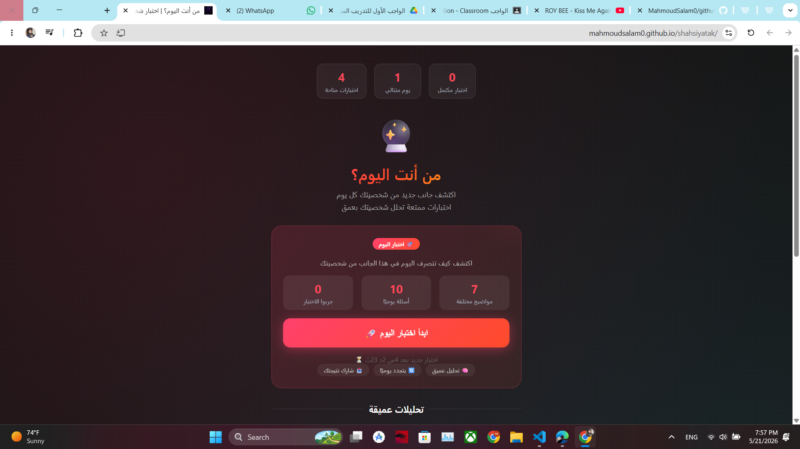

# Shahsiyatak - Personal Portfolio Website

## Project Description

Shahsiyatak is a personal portfolio website designed to showcase personal information, skills, and projects in a clean and responsive user interface.

The website was developed as part of Git & GitHub practical training and demonstrates the use of modern front-end development concepts with organized project structure and version control using Git.

## Live Demo

https://mahmoudsalam0.github.io/shahsiyatak/

## Technologies Used

- HTML5
- CSS3
- JavaScript
- Git & GitHub

## Features

- Responsive Design
- Modern UI Layout
- Navigation Bar
- Personal Information Section
- Footer Section
- Smooth User Experience

## Project Structure

```text
shahshiyatak/
│
├── assets/
│   ├── css/
│   │   └── style.css
│   ├── js/
│   │   └── script.js
│   ├── images/
│   │   └── og-image.jpg
│   └── icons/
│       └── [All Favicon & App Icons]
│
├── pages/
│   ├── confidence-test.html
│   ├── eq-test.html
│   ├── job-test.html
│   └── personality-test.html
│
├── screenshots/
│   └── home-page.png
│
├── index.html
├── about.html
├── contact.html
├── privacy.html
└── README.md
```

## Screenshots



### Home Page


## How to Run the Project

1. Clone the repository:

```bash
git clone https://github.com/MahmoudSalam0/github-training-project.git
```

2. Open the project folder.

3. Run `index.html` in your browser.

## Git Commands Used

```bash
git init
git add .
git commit -m "Initial project setup"
git checkout -b feature/design-update
git merge feature/design-update
git push
```

## Author

Mahmoud Ahmad AbdalSalam
